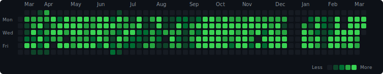

<h1 align="center">
  
</h1>

<h3 align="center">Desenvolvedor Full Stack</h3>

  
  
  

---

### 👨‍💻 Sobre mim

Sou o Giovane, dev Full Stack. Atualmente trabalho com Vue.js e AdonisJS, mas já passei por bastante coisa com PHP e Express também. Gosto de resolver problemas reais e deixar o código limpo e funcional. Nas horas vagas, estou sempre testando alguma tecnologia nova ou mexendo em algum side project.

---

### 🚀 Tech Stack

  <strong>Front-end</strong> 
  
  
  
  
  

  <strong>Back-end</strong> 
  
  
  
  

  <strong>Ferramentas</strong> 
  
  
  
  

---

### ⏱️ Coding Stats

<!-- WAKATIME:START -->

  
  
  

<table align="center">
<tr><th>Linguagem</th><th>Tempo</th><th></th></tr>
<tr>
<td><strong>TypeScript</strong></td>
<td>12 hrs 55 mins</td>
<td></td>
</tr>
<tr>
<td><strong>Vue</strong></td>
<td>11 hrs 39 mins</td>
<td></td>
</tr>
<tr>
<td><strong>Markdown</strong></td>
<td>34 mins</td>
<td></td>
</tr>
<tr>
<td><strong>JavaScript</strong></td>
<td>33 mins</td>
<td></td>
</tr>
<tr>
<td><strong>Other</strong></td>
<td>3 mins</td>
<td></td>
</tr>
</table>

<!-- WAKATIME:END -->

---

### 📈 Histórico de Atividade

  

---

  

